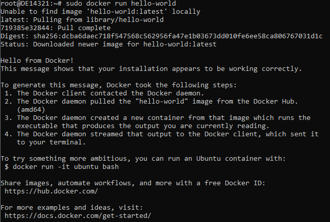

# Chisel

## What is Chisel?
Chisel stands for "Constructing Hardware In a Scala Embedded Language." It's a hardware description language embedded in Scala, a programming language. 
Chisel is used to describe digital hardware designs at a higher level of abstraction compared to traditional hardware description languages (HDLs) like Verilog or VHDL.

## Benefits
Chisel offers conciseness, modularity, and reusability, making it easier to design complex hardware systems. It leverages the power of a general-purpose programming language (Scala) for hardware design, enabling better abstraction and maintainability.

**Productivity:** Chisel's higher-level abstractions streamline the design process, reducing development time and errors.

**Portability:** FIRRTL enables designs to be retargeted to different hardware platforms easily.

**Optimization:** FIRRTL allows for hardware optimizations that can improve performance and reduce resource usage.

**Maintainability:** Chisel's modularity and the use of a programming language make designs more maintainable and adaptable to evolving requirements.


# Chisel Installation Guide

### Prerequisites
    1. Linux Environment (Debian or Debian based Distros preferred) [WSL2 for Windows] 
    2. Docker (for Interactive Guide from Chisel-Bootcamp) [Optional]
    3. Python 3
    4. Java & Java JDK
    5. Scala
    6. Firtool
    7. Verilator 
    8. Github Account


## Install Docker (Optional)

### Set up the repository
1. Update the apt package index and install packages to allow apt to use a repository over HTTPS:
```bash
sudo apt-get update
sudo apt-get install ca-certificates curl gnupg wget -y
```

2. Add Docker’s official GPG key:
```bash
sudo install -m 0755 -d /etc/apt/keyrings
curl -fsSL https://download.docker.com/linux/debian/gpg | sudo gpg --dearmor -o /etc/apt/keyrings/docker.gpg
sudo chmod a+r /etc/apt/keyrings/docker.gpg
```

3. Use the following command to set up the repository:
```bash
echo \
  "deb [arch="$(dpkg --print-architecture)" signed-by=/etc/apt/keyrings/docker.gpg] https://download.docker.com/linux/debian \
  "$(. /etc/os-release && echo "$VERSION_CODENAME")" stable" | \
  sudo tee /etc/apt/sources.list.d/docker.list > /dev/null
```
4. Update the apt package index
```bash
sudo apt-get update
```

### Install Docker Engine

1. Install Docker Engine, containerd, and Docker Compose
```bash
sudo apt-get install docker-ce docker-ce-cli containerd.io docker-buildx-plugin docker-compose-plugin -y
```

2. Verify that the Docker Engine installation is successful by running the hello-world image:
```bash
sudo docker run hello-world
```


If you receive error message `docker: Cannot connect to the Docker daemon at unix:///var/run/docker.sock. Is the docker daemon running?.`, check if docker service is started successfully by running 
```bash
sudo service docker status
# If you get "Failed!" as a status message, start the service by running
sudo service docker start
# Try again to verify the docker installation is successfull by repeating the 2. step
```

You have now successfully installed and started Docker Engine. The `docker` user group exists but `contains no users`, which is why you're required to use `sudo` to run Docker commands.

## Run Chisel Bootcamp Container

**Notice:**
There is also a Interactive Web version of this Jupyter Notebook. You can open it on the Browser by following this [link](https://mybinder.org/v2/gh/freechipsproject/chisel-bootcamp/master), or typing `https://mybinder.org/v2/gh/freechipsproject/chisel-bootcamp/master` to the browser search bar.

Make sure you have Docker [installed](#install-docker-optional) on your system.

Run the following command:

```bash
docker run -it --rm -p 8888:8888 ucbbar/chisel-bootcamp
```
This will download a Dokcer image for the bootcamp and run it. The output will end in the following message:

```
    To access the notebook, open this file in a browser:
        file:///home/bootcamp/.local/share/jupyter/runtime/nbserver-6-open.html
    Or copy and paste one of these URLs:
        http://79b8df8411f2:8888/?token=LONG_RANDOM_TOKEN
     or http://127.0.0.1:8888/?token=LONG_RANDOM_TOKEN
```

Copy the last link, the one starting with https://127.0.0.1:8888 to your browser and follow the Bootcamp.

## Chisel Installation

### 1. Install the JVM
```bash
sudo apt-get install default-jdk -y
```
Checkup your setup with the command `java --version`, which should output:
```bash
$ java --version
openjdk 11.0.20 2023-07-18
OpenJDK Runtime Environment (build 11.0.20+8-post-Debian-1deb11u1)
OpenJDK 64-Bit Server VM (build 11.0.20+8-post-Debian-1deb11u1, mixed mode, sharing)
```

### 2. Install Scala Coursier

Run the following command in your terminal, following the on-screen instructions.
```bash
curl -fL https://github.com/coursier/coursier/releases/latest/download/cs-x86_64-pc-linux.gz | gzip -d > cs && chmod +x cs && ./cs setup
```

Close active terminal and open new terminal in order the changes to take effect.


Check your setup with the command `scala -version`, which should output:
```bash
$ scala -version
Scala code runner version 3.3.0 -- Copyright 2002-2022, LAMP/EPFL
```

### 3. Install `sbt` with `cs` setup 
```bash
cs setup
sbt --script-version
```
This should install the latest stable version of `sbt`.

### 4. Install Firtool

```bash
wget -q -O - https://github.com/llvm/circt/releases/download/firtool-1.38.0/firrtl-bin-ubuntu-20.04.tar.gz | tar -zx
```

This will give you a directory called `firtool-1.38.0` containing the firtool binary, add this to your PATH as appropriate.
```bash
export PATH=$PATH:$PWD/firtool-1.38.0/bin
```

Alternatively, you can install the binary to a standard location by simply moving the binary (if you have root access).
```bash
mv firtool-1.38.0/bin/firtool /usr/local/bin/
```
Check your setup with the command `firtool --version`, which should output:
```bash
$ firtool --version
LLVM (http://llvm.org/):
  LLVM version 17.0.0git
  Optimized build.
CIRCT firtool-1.38.0
```

<div class="page"/>

### 5. Install Python 3
A couple of dependencies and tools are required for the installation  of Python3 to be successfully installed. Therefore, install the dependencies as shown:
```bash
sudo apt install build-essential zlib1g-dev libncurses5-dev libgdbm-dev libnss3-dev libssl-dev libreadline-dev libffi-dev libsqlite3-dev wget libbz2-dev -y
```
To install Python from Debian's APT repository, run the command:
```bash
sudo apt install python3 -y
```

Check your setup with the command `python3 --version`, which should output:
```bash
$ python3 --version
Python 3.9.2
```

In Python, PIP is a package manager that allows you to install packages and libraries that are not part of the standard Python library.

To install PIP, run the following command.
```bash
sudo apt install python3-pip -y
```
Check your setup with the command `pip3 -V`, which should output:
```bash
$ pip3 -V
pip 20.3.4 from /usr/lib/python3/dist-packages/pip (python 3.9)
```

### 6. Install Verilator

We currently recommend Verilator version v4.226.
Follow these instructions to compile it from source.

Install prerequisites (if not installed already):
```bash
sudo apt-get install git make autoconf g++ flex bison python3-venv -y
```

<div class="page"/>

Clone the Verilator repository:
```bash
git clone https://github.com/verilator/verilator
cd verilator
```

In the Verilator repository directory, check out a known good version:
```bash
git pull
git checkout v4.226
```

In the Verilator repository directory, build and install:
```bash
unset VERILATOR_ROOT # For bash, unsetenv for csh
autoconf # Create ./configure script
./configure
make -j 8  # -j N will spawn N threads that compile the code in parallel
sudo make install
cd ..
```

You have installed Chisel and all the dependencies. Next step is to create a project using [chisel-template](https://github.com/freechipsproject/chisel-template).

## Create a Chisel project using `chisel-template`

We recommend you've read and completed the [Chisel Bootcamp](#run-chisel-bootcamp-container) first before start your own Chisel Project.

The following procedure should get you started with a clean running Chisel3 project. It's easier to use `Github` or `Github CLI` to create a Chisel3 project than manually installing all of the libraries. Because of that we're gonna use `Github CLI` to create our first Chise3 Project.

### 1. Install Github CLI and login into Github

First add Github APT-repository to repositories and install Github CLI
```bash
type -p curl >/dev/null || (sudo apt update && sudo apt install curl -y)
curl -fsSL https://cli.github.com/packages/githubcli-archive-keyring.gpg | sudo dd of=/usr/share/keyrings/githubcli-archive-keyring.gpg \
&& sudo chmod go+r /usr/share/keyrings/githubcli-archive-keyring.gpg \
&& echo "deb [arch=$(dpkg --print-architecture) signed-by=/usr/share/keyrings/githubcli-archive-keyring.gpg] https://cli.github.com/packages stable main" | sudo tee /etc/apt/sources.list.d/github-cli.list > /dev/null \
&& sudo apt update \
&& sudo apt install gh -y
```

After installation of Github CLI, it needs to be authenticated with Github Servers. Run `gh auth logän` to authenticate with your GitHub account. Alternatively, `gh` will respect the `GITHUB_TOKEN` environment variable.

```bash
gh auth login # Follow the instructions on terminal to authenticate corrctly
```

### 2. Create a repository from the template
```bash
gh repo create <repo_name> --public -p https://github.com/freechipsproject/chisel-template
```

Wait for the template cleanup workflow to complete
After using the template to create your own blank project, please wait a minute or two for the `Template cleanup` workflow to run which will removes some template-specific stuff from the repository (like the LICENSE). Refresh the repository page in your browser until you see a 2nd commit by `actions-user` titled `Template cleanup`.

If `Template Cleanup` workflow fails to complete, make sure the permissions for he Actions in `Repository > Settings > Actions > General > Workflow Permissions` are correctly set.

After the correct permissions are set. re-run the failed jobs by running `gh run rerun --failed` in your terminal.
```bash
$ gh run rerun --failed -R <OWNER>/<repo_name>
? Select a workflow run X Initial commit, Template Cleanup (main) XmXXs ago
✓ Requested rerun (failed jobs) of run 5925397677
```

### 3. Clone the repository

Once you have created a repository from this template and the Template cleanup workflow has completed, you can start to cloning your repository by running following command into terminal.

<div class="page"/>

```bash
gh repo clone <OWNER>/<repo_name>
cd <repo_name>
```

### 4. Set project organization and name in build.sbt
The cleanup workflow will have attempted to provide sensible defaults for `ThisBuild / organization` and `name` in the `build.sbt`. Feel free to use your text editor of choice to change them as you see fit.

### 5. Verify Chisel3 project setup

You should now have a working Chisel3 project.

You can run the included test with:
```bash
sbt test
```
You should see a whole bunch of output that ends with something like the following lines:
```bash
[info] Tests: succeeded 1, failed 0, canceled 0, ignored 0, pending 0
[info] All tests passed.
[success] Total time: 5 s, completed Dec 16, 2020 12:18:44 PM
```


If you see the above then... **It Worked!** You are ready to go. 

We recommend following the [Chisel Bootcamp](#run-chisel-bootcamp-container) for learning and practices.